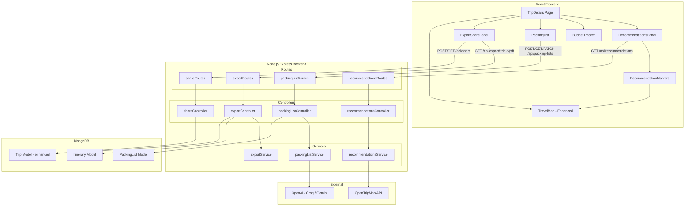

# Design Document: Travel Engine Enhancements

## Overview

This design extends the RoamAI Travel Planning & Experience Engine with four major feature areas: Nearby Recommendations, Budget Tracker, AI Packing List Generator, and Trip Export/Share. Each feature integrates into the existing Trip Details page and leverages the current architecture (React frontend with Leaflet maps, Node.js/Express backend, MongoDB with Mongoose, OpenAI service, and Socket.io real-time layer).

The design follows the existing patterns: controllers handle route logic, services encapsulate external API calls and business logic, Mongoose models define data persistence, and React components consume REST APIs via axios.

### Key Design Decisions

1. **Places API Choice**: Use OpenTripMap (free, no billing required) as the primary recommendations provider, with a mock fallback matching the existing weather service pattern.
2. **Budget computation on frontend**: Budget aggregation is a pure computation over existing itinerary data — no new backend endpoint needed. This keeps it reactive and avoids redundant API calls.
3. **PDF generation with PDFKit**: Server-side PDF generation using the `pdfkit` library, streamed directly to the client as a downloadable response.
4. **Share tokens via crypto**: Use `crypto.randomBytes` for generating unique share tokens stored on the Trip model, with a dedicated public route that bypasses auth middleware.
5. **Packing list as embedded subdocument**: Store packing lists in a new `PackingList` model linked to trips, enabling independent CRUD operations on check states.

## Architecture



## Components and Interfaces

### Backend Components

#### 1. Recommendations Service (`services/recommendationsService.js`)

```javascript
/**
 * Fetches nearby points of interest from OpenTripMap API
 * @param {number} lat - Latitude of the activity location
 * @param {number} lng - Longitude of the activity location
 * @param {number} radius - Search radius in meters (default: 1000)
 * @returns {Promise<{categories: Object, total: number}>}
 */
async function getNearbyRecommendations(lat, lng, radius = 1000)

/**
 * Mock fallback when API is unavailable
 * @param {number} lat
 * @param {number} lng
 * @returns {{categories: Object, total: number}}
 */
function getMockRecommendations(lat, lng)
```

#### 2. Recommendations Controller (`controllers/recommendationsController.js`)

```javascript
/**
 * GET /api/recommendations?lat=X&lng=Y&radius=Z
 * Returns up to 10 nearby recommendations grouped by category
 */
async function getRecommendations(req, res)
```

#### 3. Packing List Service (`services/packingListService.js`)

```javascript
/**
 * Generates a categorized packing list using AI
 * @param {Object} params - { destination, startDate, endDate, weather, activities }
 * @returns {Promise<Array<{category: string, items: Array<{name: string, checked: boolean}>}>>}
 */
async function generatePackingList(params)

/**
 * Fallback packing list when AI is unavailable
 * @param {Object} params
 * @returns {Array<{category: string, items: Array<{name: string, checked: boolean}>}>}
 */
function generateFallbackPackingList(params)
```

#### 4. Packing List Controller (`controllers/packingListController.js`)

```javascript
/**
 * POST /api/packing-lists/:tripId/generate - Generate new packing list
 * GET /api/packing-lists/:tripId - Get existing packing list
 * PATCH /api/packing-lists/:tripId/items/:itemId - Toggle item checked state
 */
async function generateList(req, res)
async function getList(req, res)
async function toggleItem(req, res)
```

#### 5. Export Service (`services/exportService.js`)

```javascript
/**
 * Assembles trip data into a structured format for PDF generation
 * @param {Object} trip - Trip document
 * @param {Object} itinerary - Itinerary document
 * @returns {Object} Assembled data structure with all required fields
 */
function assemblePdfData(trip, itinerary)

/**
 * Generates a PDF buffer from assembled trip data
 * @param {Object} pdfData - Output from assemblePdfData
 * @returns {Promise<Buffer>} PDF file buffer
 */
async function generatePdf(pdfData)
```

#### 6. Export Controller (`controllers/exportController.js`)

```javascript
/**
 * GET /api/export/:tripId/pdf - Generate and download PDF
 */
async function exportPdf(req, res)
```

#### 7. Share Controller (`controllers/shareController.js`)

```javascript
/**
 * POST /api/share/:tripId - Generate or regenerate share link
 * GET /api/shared/:token - Public access to shared trip (no auth)
 */
async function createShareLink(req, res)
async function getSharedTrip(req, res)
```

### Frontend Components

#### 1. RecommendationsPanel (`components/RecommendationsPanel.jsx`)

- Displays a list of nearby recommendations grouped by category
- Triggered when user clicks an Activity_Card
- Shows name, category icon, distance, and rating for each place
- Communicates selected recommendations to the map

#### 2. RecommendationMarkers (integrated into `TravelMap.jsx`)

- Extends existing TravelMap to accept recommendation data
- Renders category-colored markers with popups
- Clears markers when activity selection changes

#### 3. BudgetTracker (`components/BudgetTracker.jsx`)

- Pure computation component — receives itinerary and budget as props
- Computes: total cost, per-day costs, category breakdowns
- Renders progress bars and percentage labels
- Shows overage warning when total exceeds budget

#### 4. PackingList (`components/PackingList.jsx`)

- Displays categorized packing list with checkboxes
- Handles generate, load, and toggle interactions
- Shows loading/error states

#### 5. ExportSharePanel (`components/ExportSharePanel.jsx`)

- Contains "Export PDF" button and "Share Trip" button
- Manages share link display with copy-to-clipboard
- Shows loading and error states for both operations

### API Route Summary

| Method | Path | Auth | Description |
|--------|------|------|-------------|
| GET | `/api/recommendations` | Yes | Fetch nearby POIs by coordinates |
| POST | `/api/packing-lists/:tripId/generate` | Yes | Generate AI packing list |
| GET | `/api/packing-lists/:tripId` | Yes | Get saved packing list |
| PATCH | `/api/packing-lists/:tripId/items/:itemId` | Yes | Toggle item checked state |
| GET | `/api/export/:tripId/pdf` | Yes | Download trip PDF |
| POST | `/api/share/:tripId` | Yes | Generate/regenerate share link |
| GET | `/api/shared/:token` | No | View shared trip (public) |

## Data Models

### PackingList Model (`models/PackingList.js`)

```javascript
const PackingListSchema = new mongoose.Schema({
  tripId: {
    type: mongoose.Schema.Types.ObjectId,
    ref: 'Trip',
    required: true,
    unique: true
  },
  categories: [{
    name: {
      type: String,
      required: true
      // e.g., "clothing", "toiletries", "electronics", "documents", "activity-specific gear"
    },
    items: [{
      name: { type: String, required: true },
      checked: { type: Boolean, default: false }
    }]
  }],
  generatedAt: {
    type: Date,
    default: Date.now
  }
}, { timestamps: true });
```

### Trip Model Enhancement (add share fields)

```javascript
// Additional fields on existing TripSchema:
shareToken: {
  type: String,
  default: null,
  index: true,
  sparse: true
},
shareCreatedAt: {
  type: Date,
  default: null
}
```

### Recommendation Response Shape (not persisted)

```javascript
// Response from GET /api/recommendations
{
  categories: {
    café: [{ name, distance, rating, lat, lng }],
    restaurant: [{ name, distance, rating, lat, lng }],
    atm: [{ name, distance, rating, lat, lng }],
    pharmacy: [{ name, distance, rating, lat, lng }],
    photo_spot: [{ name, distance, rating, lat, lng }]
  },
  total: Number // max 10
}
```

### Budget Computation Shape (frontend-only, derived)

```javascript
// Computed by BudgetTracker component from itinerary data
{
  totalBudget: Number,        // from trip.budget
  totalEstimatedCost: Number, // sum of all activity costs
  dailyAllocation: Number,    // totalBudget / numberOfDays
  perDay: [{
    day: String,              // "day1", "day2", etc.
    cost: Number,             // morning + afternoon + evening costs
    percentage: Number        // cost / dailyAllocation * 100
  }],
  categories: {
    food: { amount: Number, percentage: Number },
    transport: { amount: Number, percentage: Number },
    activities: { amount: Number, percentage: Number }
  },
  isOverBudget: Boolean
}
```

## Correctness Properties

*A property is a characteristic or behavior that should hold true across all valid executions of a system — essentially, a formal statement about what the system should do. Properties serve as the bridge between human-readable specifications and machine-verifiable correctness guarantees.*

### Property 1: Radius filtering correctness

*For any* valid latitude/longitude coordinates and a set of place results from the API, the recommendations service SHALL only return places whose computed distance from the input coordinates is less than or equal to the specified radius (1000m by default).

**Validates: Requirements 1.1**

### Property 2: Grouping and limiting

*For any* set of raw place results (of any size), the recommendations service SHALL return results grouped by category with a total count of at most 10 items across all categories.

**Validates: Requirements 1.2**

### Property 3: Recommendation display completeness

*For any* recommendation object with name, category, coordinates, and optional rating, the formatted display data SHALL include the name, category label, computed distance, and rating (or a "N/A" placeholder if rating is absent).

**Validates: Requirements 1.4**

### Property 4: Category-to-icon mapping uniqueness

*For any* two distinct recommendation categories from the set {café, restaurant, ATM, pharmacy, photo_spot}, the icon/color mapping function SHALL return distinct visual identifiers.

**Validates: Requirements 2.2**

### Property 5: Budget total aggregation invariant

*For any* itinerary with N days where each day has morning, afternoon, and evening activity slots with numeric cost fields, the total estimated cost SHALL equal the sum of all individual activity costs, and each per-day total SHALL equal the sum of its three slot costs.

**Validates: Requirements 3.1, 3.2**

### Property 6: Category breakdown correctness

*For any* itinerary, the sum of the food, transport, and activities category totals SHALL equal the total estimated cost, where food is derived from food-related cost portions, transport from transport costs, and activities from the activity cost fields.

**Validates: Requirements 3.3**

### Property 7: Budget visualization computations

*For any* trip budget B and number of days D (where D > 0), the daily allocation SHALL equal B / D, and for any set of category amounts, their percentages SHALL sum to approximately 100% (within floating-point rounding tolerance of ±1%).

**Validates: Requirements 4.2, 4.3**

### Property 8: Packing list prompt completeness

*For any* trip with destination, start date, end date, weather data, and planned activities, the AI prompt constructed by the packing list service SHALL contain all five context parameters as substrings.

**Validates: Requirements 5.1**

### Property 9: Packing list parsing categorization

*For any* valid AI response containing items organized into categories, the parsing function SHALL produce an array of category objects where each item belongs to exactly one of the defined categories (clothing, toiletries, electronics, documents, activity-specific gear), and every item has a `checked` field initialized to `false`.

**Validates: Requirements 5.2**

### Property 10: Packing list persistence round-trip

*For any* packing list with categories and items in arbitrary checked states, saving to the database and then loading by trip ID SHALL produce an identical list structure with all checked states preserved. Furthermore, regenerating a packing list for a trip that already has one SHALL replace all items and reset all checked states to false.

**Validates: Requirements 6.2, 6.3, 6.4**

### Property 11: PDF content assembly completeness

*For any* trip (with destination, dates, budget) and its associated itinerary (with N days of morning/afternoon/evening slots), the assembled PDF data SHALL contain the trip destination, start date, end date, budget, and for every activity slot: the attraction name, activity description, cost, food recommendation, and transport mode.

**Validates: Requirements 7.1, 7.2**

### Property 12: Share link uniqueness

*For any* two distinct share link generation requests (whether for the same trip or different trips), the generated tokens SHALL be unique (no collisions).

**Validates: Requirements 8.1**

### Property 13: Share link regeneration invalidation

*For any* trip with an existing share token, regenerating the share link SHALL produce a new token different from the previous one, and the previous token SHALL no longer resolve to valid trip data.

**Validates: Requirements 8.4**

## Error Handling

### Recommendations Service
- **API timeout/failure**: Return `{ error: true, message: "Unable to fetch nearby recommendations. Please try again later." }` and log the error. Frontend displays a fallback notice card.
- **Invalid coordinates**: Return 400 with validation message before making external call.
- **Empty results**: Return empty categories object with total: 0 (not an error).

### Budget Tracker
- **Missing cost fields**: Treat undefined/null cost values as 0 during aggregation.
- **Zero days**: Guard against division by zero in daily allocation (minimum 1 day).
- **Non-numeric costs**: Coerce to number with `Number()`, default to 0 if NaN.

### Packing List Service
- **AI service unavailable**: Fall back to `generateFallbackPackingList()` which returns a generic categorized list based on trip duration and destination climate.
- **Malformed AI response**: Wrap parsing in try/catch, return fallback list on parse failure.
- **Trip not found**: Return 404 with descriptive message.
- **Item not found for toggle**: Return 404 with item-specific message.

### Export Service
- **PDF generation failure**: Catch PDFKit errors, return 500 with `{ error: true, message: "PDF generation failed. Please try again." }`.
- **Trip/itinerary not found**: Return 404 before attempting generation.
- **Large itineraries**: Stream PDF to response rather than buffering entire document in memory.

### Share Service
- **Invalid/expired token**: Return 404 with `{ error: true, message: "This shared trip link is no longer valid." }`.
- **Token generation collision** (extremely unlikely with 32-byte random): Retry once with new random bytes.
- **Unauthorized share attempt**: Verify trip ownership before generating link.

## Testing Strategy

### Unit Tests (Example-Based)

- **Recommendations**: API error handling (1.3), marker popup content (2.3), marker clearing on selection change (2.4)
- **Budget Tracker**: Overage warning display (4.4), recalculation on itinerary change (3.4), budget summary panel rendering (4.1)
- **Packing List**: AI error fallback (5.3), UI display with checkboxes (5.4), persistence integration (6.1)
- **Export**: PDF download headers (7.3), generation error handling (7.4)
- **Share**: Unauthenticated access (8.2), read-only shared view (8.3), copy-to-clipboard button (8.5)

### Property-Based Tests

Property-based testing is appropriate for this feature because it contains multiple pure computation functions (budget aggregation, distance filtering, data assembly) and data transformation logic (packing list parsing, PDF assembly, token generation) where universal properties hold across a wide input space.

**Library**: [fast-check](https://github.com/dubzzz/fast-check) (JavaScript property-based testing)

**Configuration**:
- Minimum 100 iterations per property test
- Each test tagged with: `Feature: travel-engine-enhancements, Property {N}: {title}`

**Property tests to implement**:
1. Radius filtering correctness (Property 1)
2. Grouping and limiting (Property 2)
3. Recommendation display completeness (Property 3)
4. Category-to-icon mapping uniqueness (Property 4)
5. Budget total aggregation invariant (Property 5)
6. Category breakdown correctness (Property 6)
7. Budget visualization computations (Property 7)
8. Packing list prompt completeness (Property 8)
9. Packing list parsing categorization (Property 9)
10. Packing list persistence round-trip (Property 10)
11. PDF content assembly completeness (Property 11)
12. Share link uniqueness (Property 12)
13. Share link regeneration invalidation (Property 13)

### Integration Tests

- End-to-end recommendations flow: activity click → API call → markers on map
- Packing list generate → save → reload → toggle → verify state
- PDF export download with valid trip data
- Share link generation → public access → regeneration → old link invalid

### New Dependencies

**Backend**:
- `pdfkit` — PDF generation
- `fast-check` (devDependency) — Property-based testing
- `jest` or `vitest` (devDependency) — Test runner

**Frontend**:
- No new production dependencies (uses existing axios, Leaflet, lucide-react)
- `@testing-library/react` (devDependency) — Component testing
- `vitest` (devDependency) — Test runner
